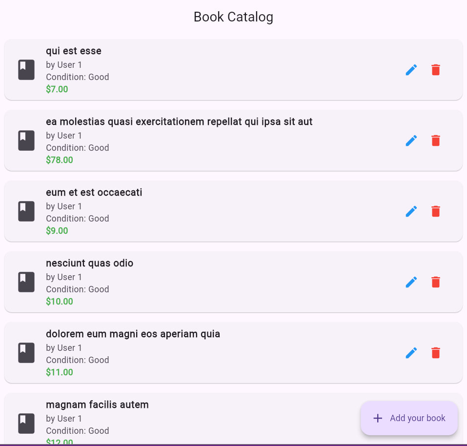
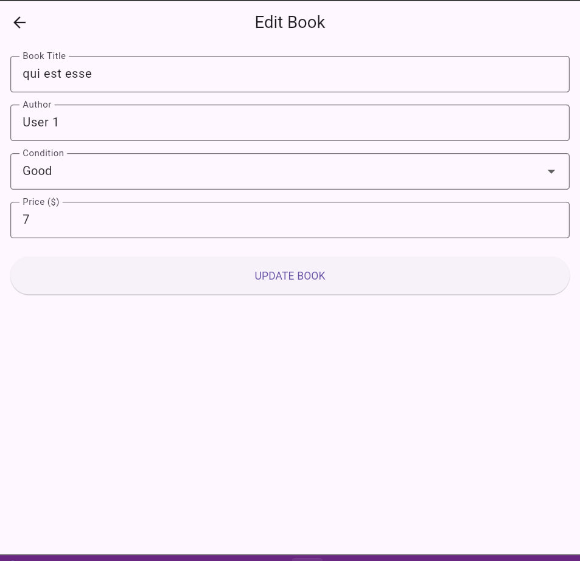
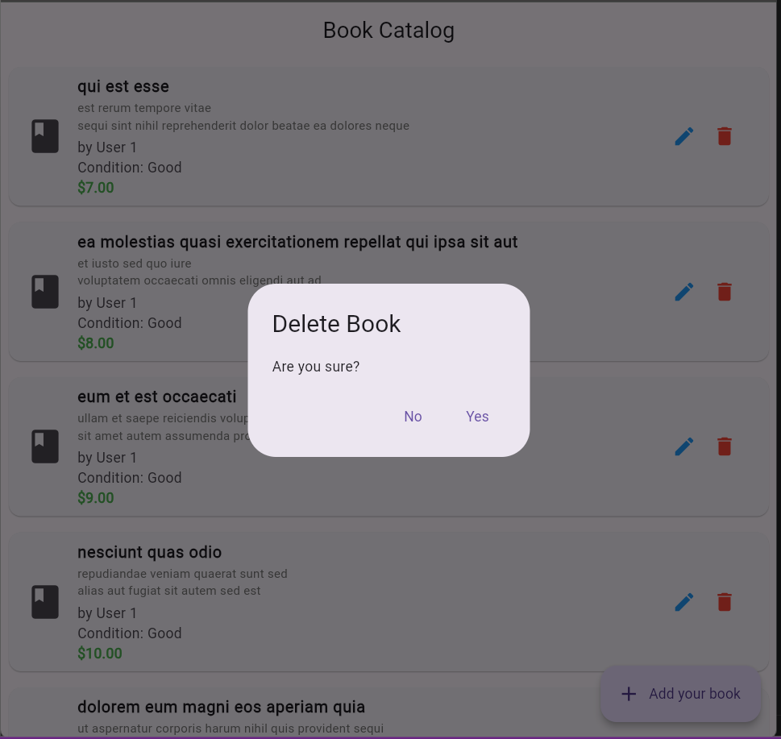
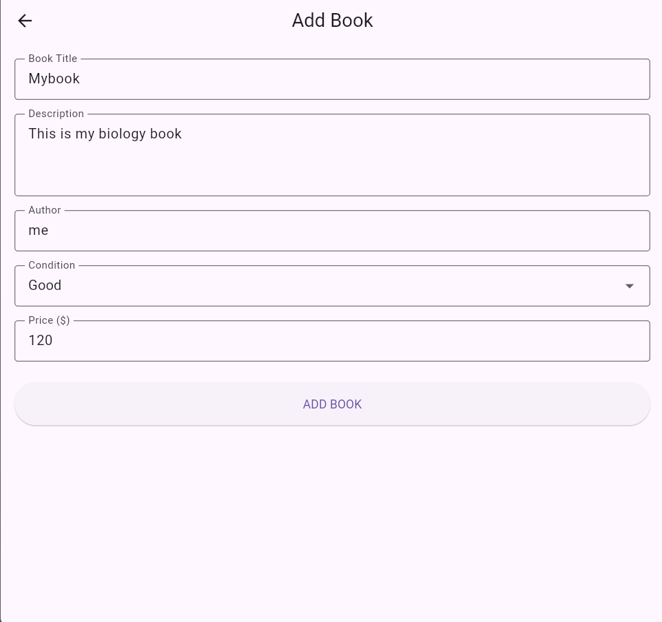

# book_catalog_app_using_dio

A Flutter application that performs CRUD operations using Bloc for state management and dio for api reqests.
| name | ugr |
|-------|-------|
| Yeabsera Zewdu | UGR/1970/16 | 

## Features

- Create new book listings
- Read/view all books
- Update book details
- Delete book listings
- Loading states
- Error handling

## Screenshots




## Packages used
 
 - Flutter
 - Bloc
 - DIO 
 - JSONPLACEHOLDER

## Instructions to run
  ```bash
  flutter pub get
  flutter run 


